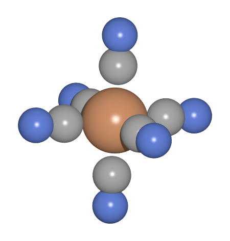

.. _fecn6_water:

=======================================
QM/MM BOMD of Iron Hexacyanide in Water
=======================================

This tutorial shows one example of how to build the transition-metal complex iron(II) 
hexacyanide, :mol:`[Fe(II)CN_6]`\ :sup:`4-`, solvate and charge-neutralize the system in water with MM counterions, 
and equilibrate the entire system using Born-Oppenheimer MD. The QM code used here is ORCA.

This tutorial assumes you have already gotten an overview of using :ref:`qmmm`, and have carried out the 
necessary benchmarks on basis sets sizes/plane wave cutoffs/grid spacing, density functionals, etc. 

New users should seek more info on what QM/MM coupling entails, and how to ensure its validity
through `this tutorial review <http://dx.doi.org/10.1002/qua.26343>`__, which this
tutorial is built upon. 

.. note:: QM/MM BOMD is generally expensive, and the final simulation is meant to be submitted 
          to a cluster with an expected walltime of several days.

Building the Complex
--------------------
Let us simply build the complex ourselves:

.. literalinclude:: build_fecn6.py

Which should give you a molecule that looks like this:

Relaxing its Vacuum Geometry
----------------------------
 
.. literalinclude:: opt_fecn6_orca.py 

Solvating and Charge-Neutralizing the Complex
---------------------------------------------
We will use the method found in :ref:`tipnp water box equilibration` to 
make a simulation cell of water molecules:

.. literalinclude:: waterbox.py

A method generating a constraints-object is imported from a separate file because it will 
also be used later, so make sure if you do the same that the file containing this method
is in your PYTHONPATH, or in the same directory as the script above.

.. literalinclude:: rigid_water.py

This version uses a faster, c-based implementation included in GPAW, but can be replaced with:
``from ase.constraints import FixBondLengths`` if you don't have access to GPAW. However, the loss
in efficiency can be substantial for big water boxes, so beware. Alternatively, use a different
MD driver.

We then place the complex in the water box and delete overlapping molecules using this script:

.. literalinclude:: solvate.py

The script is invoked by writing::

        python solvate.py FeCN6_opt.traj@-1 tip4p_2744mol_equil.traj@-1 3 2.5 1

It centers the last frame of the relaxed trajectory ``FeCN6_opt.traj`` in the last frame of the 
equilibrated water box ``tip4p_2744mol_equil.traj``. ``3`` is the number of atoms per molecule in water, 
``2.5`` is the minimum radius between solute and solvent, and ``1`` tells the script to enforce wrapping 
of the water box before solvating the solute, since .xyz files do not contain information about periodic boundary conditions. 

We now need to add counterions to the total system, by adding four K+ counterions to the cell and remove overlapping waters:

   .. literalinclude:: add_ctions.py 

Basically a very similar method as used for the solvation of the complex.

Running the QM/MM BOMD Simulation
---------------------------------
The following code includes all the necessary steps for perfoming the actual QM/MM BOMD 
simulation on the simulation box, now fully prepared for the last round of equilibration, 
to let the positions of the complex, water molecules, and counterions adjust to each other. 

The script can look somewhat long compared to input files for other programs, but many of 
its functionalities (eg, assignment of LJ parameters) can be saved somewhere centrally instead, 
and simply imported at the beginning of the script. 

Lines 15–21 define the prefix for the output files from the simulation, make a list with
the indices of the atoms of the complex, which will make up the QM subsystem, and read in 
the simulation box created in the previous step. Lines 25–42 initialize the ASE calculator 
that handles the classical interaction potential between the counterions and the solvent. 
The potential consists of a Coulomb and an LJ term and thus needs LJ parameters from the 
water potential as well as the counterions. The LJ potential used in the parameterization 
of the potassium ions provides :math:`R_\mathrm{min}` (the position of the well-bottom), not :math:`\sigma`, 
hence the conversion factor in line 30.

The partial charges are carried by the ASE calculator-objects, so one does not have to
specify it explicitly for potentials where they are always the same (e.g. the TIP4P potential).
The calculator for the counterions takes the charge as its first input, see line 38.

Lines 44–68 make arrays of LJ parameters for the evaluation of the QM/MM LJ term, and 
initialize the object that takes care of the actual evaluation. 

Lines 49–58 set up a dictionary with element keys and their corresponding LJ parameter values,
which are then expanded into lists containing one value per atom. 
Thus, if atoms of the same element do not have the same LJ parameters, we can simply define what LJ 
parameters we want for each individual atom instead.

Lines 71–83 take care of the constraints used in the simulation. We use simple flat-bottomed Hookean potentials 
to keep the counterions restrained in spheres of 1 Å within their original positions. Similarly, we restrain 
the complex to within 4 Å of the center of the cell, for the duration of the equilibration. 

In lines 85–96 of the script, the electrostatic embedding calculator object ``EIQMMM`` is initialized 
and attached to the atoms object. The object needs the indices of the ``qmatoms``, a QM calculator object, 
the MM calculator object, and embedding object taking care of interfacing the ``PointChargePotential`` ,
and the LJ interaction potential. The rest of the script runs the dynamics, just as for the pure MM MD simulations. 

  .. literalinclude:: qmmm_md_paper.py 
      :linenos:

This script should be submitted to a cluster and will most likely take a couple of days to complete. If all
has gone well, you should be able to plot energies and temperature from your BOMD simulation and see that they
stabilize.
